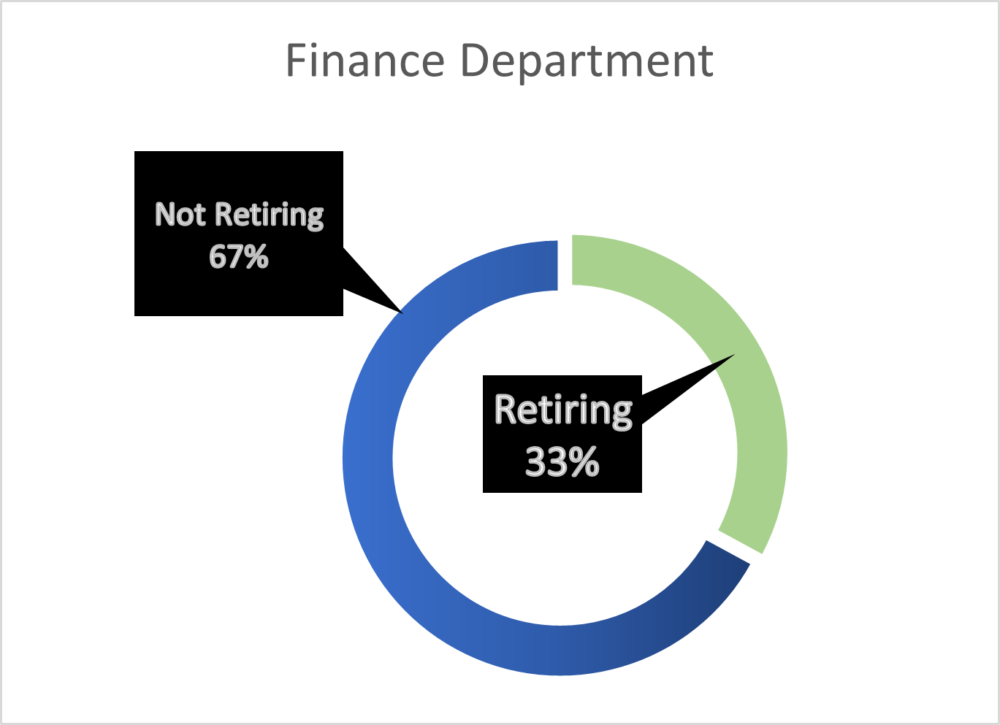
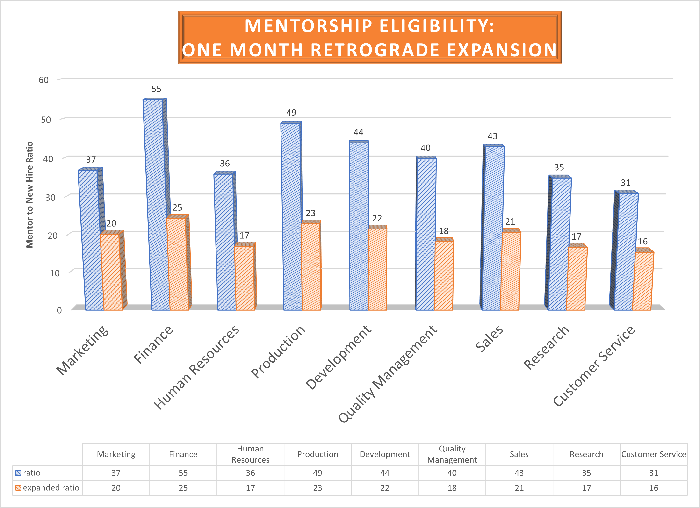

# Impending Retirements at Pewlett-Hackard:
## Managing the *Silver Tsunami*
Richard E Barber 2021, Data Analysis and Visualization

### Background:
**Pewlett-Hackard**, an extremely large corporation has recently undergone massive data transition from Excel spreadsheets across multiple files to the postgreSQL database structure. During the process analysts uncovered the fact that a large portion of the employee population is due to retire very soon. This phenomenon is often called the "Silver Tsunami". To mitigate any negative effect the retirements will have on the company, a program of mentorship when open roles are fulfilled is being offered as a potential solution.

### Results: 

| ⚫ The Production and Finance departments are poised to take the biggest retirement hits.  |
| :-------: |
| |
|     |
|  Figure 1., Upcoming Department Personnel Retirements

|  ⚫ The Finance Department will loose one-third of its workforce.  |
| :-------: |
| |
|    |
|  Figure 2., Finance Department Retirements

|  ⚫ In the Finance Department the mentor to new hire ratio will reach 1:55.  |
| :-------: |
| |
|     |
|  Figure 3., Mentor Ratios by Department
 
|  ⚫ Potential Mentor To New Hire Ratio Average 1:41. |
| :-------: |
| |
|     |
|  Figure 4., Average Mentor Ratio

### Summary:

Pewlet-Hackard's Finance Department stands to loose one-third of its workforce to upcoming retirements. In total, of 240,124 employees, 72,458 will be retiring soon, and will need to have their shoes filled upon reaching retirement. That's a whopping 30% of the total Pewlett-Hackard workforce. The average potential worker-load per mentor, or mentor:retiree ratio averages about 1:41. However, the ratio increases in the Finance and Production departments which will be impacted the most by the *silver tsunami*. We believe there are enough Pewlet Hackard employees ready for mentorship, given the enthusiasm the Finance and Production departments have exhibited and willingness to lend a hand and get the job done. As a result of our analysis, we are additionally recommending relaxing the eligibility requirements for mentors in the severely impacted departments, Finance and Production. In our hypothetica database query, we have opened the eligibility backwards by one month, from 11-30-1964 to 12-31-1965.  The effect of this doubles the available mentors and halves the ratio of mentors to new hires.

 

`####`
